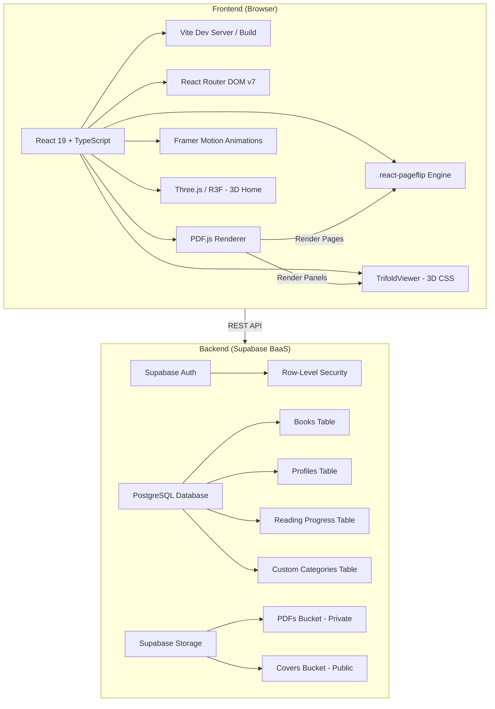
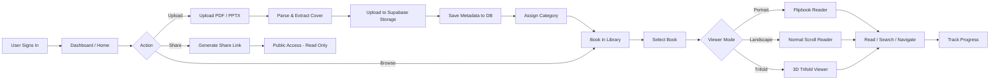

# 📚 Lifewood Philippines — Digital Library

## Project Description

---

### 1. Project Overview

The **Lifewood Digital Library** is an internally hosted web-based platform that transforms static company handbooks, policy documents, and training materials into interactive, searchable digital experiences. Designed for **Lifewood Philippines**, the system replaces the traditional distribution of physical or flat PDF documents with a modern, immersive digital library that supports realistic page-flip animations, full-text content search, organized bookmarks and navigation, role-based access controls, and automated version control for policy updates.

The platform modernizes how employees access, read, and interact with corporate literature — ensuring that the latest versions of critical documents are always available, easily discoverable, and engaging to read.

---

### 2. Problem Statement

Organizations like Lifewood Philippines rely heavily on handbooks and policy documents distributed as static PDFs or printed materials. This approach presents several challenges:

- **Poor discoverability** — Employees struggle to locate specific sections across lengthy documents.
- **Outdated copies** — Without a centralized distribution mechanism, staff may reference obsolete versions of policies.
- **Low engagement** — Static PDFs lack interactivity, leading to minimal employee engagement with important materials.
- **No usage tracking** — Management has no visibility into whether employees have accessed or read required documents.
- **Difficult distribution** — Updating and redistributing revised handbooks across the organization is time-consuming and error-prone.

---

### 3. Objectives

| # | Objective |
|---|-----------|
| 1 | Develop a centralized, web-based digital library for managing and distributing corporate handbooks and policy documents. |
| 2 | Implement realistic, interactive page-flip animations that simulate a physical book reading experience. |
| 3 | Provide full-text search capabilities for instant content discovery across all uploaded documents. |
| 4 | Enable bookmark and navigation features for quick access to specific sections and pages. |
| 5 | Enforce role-based access controls to manage document visibility based on user permissions. |
| 6 | Support automated version control to ensure employees always access the latest policy updates. |
| 7 | Design a responsive, modern user interface optimized for desktops, tablets, and mobile devices. |

---

### 4. Key Features

#### 4.1 Interactive Flip Animation
The system renders uploaded PDF documents as realistic digital flipbooks using client-side PDF parsing (PDF.js) and 3D CSS transform-based page-flip engines. Three distinct viewing modes are supported:

- **Portrait (Book) Mode** — Standard two-page spread with realistic page-turning animation, powered by `react-pageflip`. Ideal for portrait-oriented handbooks.
- **Landscape Mode** — Single-page scroll view optimized for wide-format presentations and landscape documents.
- **Trifold Mode** — A unique 3D trifold viewer with five fold states (`closed → opened_front_flap → fully_opened → back_cover_closed → back_cover_opened`), supporting single-spread, two-spread, and six-individual panel PDF formats. Uses CSS `perspective`, `preserve-3d`, and `backface-visibility` for realistic paper-fold simulation.

Additional reader features include:
- Zoom controls (50%–150%) with smooth scaling
- Auto-play mode for hands-free page progression
- Fullscreen reading mode
- Thumbnail sidebar for visual page navigation
- Keyboard shortcuts (← → for navigation, ESC to exit)

#### 4.2 Full-Text Search
Users can instantly search across document content for specific keywords and phrases. The search panel integrates with the reader view, allowing users to jump directly to matching pages. This feature eliminates the need to manually scroll through lengthy documents to find specific policies or procedures.

#### 4.3 Bookmarks & Navigation
The library provides multiple navigation mechanisms:
- **Category-based organization** — Books are organized into configurable categories (e.g., Philippines, Internal, International, PH Interns, Deseret, Angelhost) with support for user-created custom categories featuring custom colors and icons.

- **Reading progress tracking** — The system tracks each user's reading position per book, enabling seamless continuation from the last-read page.
- **Featured carousel** — A rotating showcase of highlighted documents on the home screen for quick access to key materials.

#### 4.4 Access Controls
The platform implements Supabase Authentication with Row-Level Security (RLS) to enforce role-based document access:
- Users authenticate via email/password or OAuth providers through a dedicated sign-in interface.
- RLS policies ensure users can only view, edit, and delete their own uploaded books and reading progress.
- Shared links allow controlled external access to specific books or categories without requiring authentication. Each link is **scoped** to only the shared content and **time-limited** — administrators can set expiration periods (e.g., 1 day, 7 days, 30 days, or a custom duration) after which the link is automatically revoked and displays an "Expired" status.
- Storage bucket policies separate private PDF storage from publicly accessible cover images.

#### 4.5 Version Control
The system supports automated policy updates through:
- **Upload & replace workflow** — Administrators can upload revised PDFs that replace older versions while preserving metadata and reading progress.
- **Timestamped records** — Every book record includes `created_at` and `updated_at` timestamps with automatic trigger-based updates.
- **Soft-delete & restore** — Deleted documents are moved to a "Delete History" rather than permanently removed, enabling recovery of accidentally deleted materials.
- **PPTX-to-PDF conversion** — A built-in converter allows direct upload of PowerPoint presentations, automatically converting them to PDF format for inclusion in the library.

#### 4.6 Shareable Links
The platform includes a comprehensive link-sharing system that enables controlled external access to library content without requiring recipients to sign in. Access is strictly scoped — recipients can **only** view the specific book or category that was shared with them and cannot browse, search, or access any other content in the library.

- **Token-based share links** — Each shared link generates a unique, cryptographic token (`/share/link/<token>`) that resolves to either a single book or an entire category of books. Links are stored in the database and validated on access.
- **Configurable expiration** — When generating a share link, users can set the expiration period: **Never**, **30 days**, **15 days**, **7 days**, **1 day**, or a **custom number of days**. Expired links automatically become inaccessible and display a friendly "Link Unavailable" message.
- **Two sharing scopes**:
  - **Book sharing** — Shares a single book with a dedicated landing page showing the cover, title, page count, and summary, with a "Read Now" button that opens the full interactive reader.
  - **Category sharing** — Shares an entire category as a browsable grid of book covers. Recipients can open and read any book within the shared category. Includes a video links section for supplementary training materials.
- **Shared link history** — A management panel displays all previously generated links for a given book or category in a detailed table showing: book name, category, link token, expiration progress bar (with color-coded status: green → yellow → amber → red), active/expired status, and a delete action to permanently revoke access.
- **Link revocation** — Users can delete any shared link at any time, immediately revoking access for anyone with the URL. A confirmation dialog prevents accidental revocations.
- **Public read-only access** — Recipients of shared links can view and read books using the full reader experience (flipbook mode, normal scroll mode, zoom, thumbnails, search, fullscreen, dark/light theme toggle) without needing to create an account or sign in.

---

### 5. System Architecture

---

### 6. Technology Stack

| Layer | Technology | Purpose |
|-------|-----------|---------|
| **Frontend Framework** | React 19, TypeScript | Component-based UI with type safety |
| **Build Tool** | Vite 6 | Fast HMR development and optimized production builds |
| **Styling** | Tailwind CSS | Utility-first responsive design with dark/light theming |
| **PDF Rendering** | PDF.js 4.4 | Client-side PDF parsing, page rendering, and text extraction |
| **Flipbook Engine** | react-pageflip 2.0 | Realistic page-turn animation for portrait book mode |
| **3D Graphics** | Three.js, @react-three/fiber, @react-three/drei | 3D interactive home page and visual effects |
| **Animations** | Framer Motion 12 | Smooth page transitions, modal animations, and micro-interactions |
| **Routing** | React Router DOM 7 | Client-side SPA routing with URL-based navigation |
| **Zoom/Pan** | react-zoom-pan-pinch 3.7 | Touch-friendly zoom and pan controls in reader mode |
| **Icons** | Lucide React | Consistent, lightweight icon system |
| **Authentication** | Supabase Auth | Email/password and OAuth-based user authentication |
| **Database** | Supabase PostgreSQL | Relational storage for books, profiles, progress, and categories |
| **File Storage** | Supabase Storage | Scalable blob storage for PDFs (private) and covers (public) |
| **Large Uploads** | tus-js-client | Resumable upload protocol for large PDF files (up to 150MB) |
| **PWA Support** | vite-plugin-pwa | Progressive Web App capabilities for offline and installable access |
| **Deployment** | Vercel | Serverless hosting with global CDN and automatic deployments |

---

### 7. Database Schema

The system uses four primary tables in a PostgreSQL database managed by Supabase:

| Table | Description | Key Columns |
|-------|-------------|-------------|
| `profiles` | Extends Supabase Auth users with profile data | `id` (UUID, FK → auth.users), `email`, `full_name` |
| `books` | Stores metadata for each uploaded document | `id`, `user_id`, `title`, `pdf_url`, `cover_url`, `total_pages`, `category`, `summary`, `orientation` |
| `reading_progress` | Tracks per-user reading position for each book | `id`, `user_id`, `book_id`, `current_page`, `last_read_at` |
| `custom_categories` | User-created category definitions | `id`, `user_id`, `name`, `slug`, `color`, `icon` |

All tables enforce **Row-Level Security (RLS)** ensuring data isolation between users. Database indexes are applied on `user_id`, `category`, and `created_at` for optimized query performance.

---

### 8. User Roles

| Role | Permissions |
|------|-------------|
| **Authenticated User** | Upload PDFs, manage personal library, create categories, read books, track progress, generate AI summaries, share links |
| **Unauthenticated Visitor** | View shared books/categories via public share links (read-only) |

---

### 9. System Workflow

---

### 10. Team

| Role | Members |
|------|---------|
| **Pilot** | Jaimes, Adrian |
| **Copilot** | Sherlyn, Christian, Angelo |

---

> *Lifewood Philippines Digital Library — Modernizing document distribution through interactive digital experiences.*
